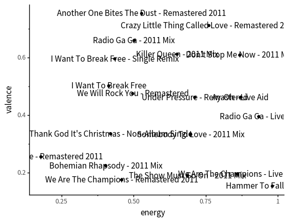

```{python setup, tags=c("input-details", "setup")}
# TODO: explain how to run this, and that they only need the gist (loads tools)
import pandas as pd
from siuba import arrange, select, mutate, filter, _, ungroup
from plotnine import *

# temporary until I figure out where to put data
fname = "https://siublocks.s3.us-east-2.amazonaws.com/course-data/music200.csv"
music_top200 = pd.read_csv(fname)

# tracks
fname = "https://siublocks.s3.us-east-2.amazonaws.com/course-data/track_features.csv"
track_features = pd.read_csv(fname)

# TODO: shift into a package or file
from siuba import pipe
from IPython.display import HTML, display
from siututor import Blank
___ = Blank()

pd.set_option("display.max_rows", 6)

from IPython import get_ipython
# special ipython function to get the html formatter
html_formatter = get_ipython().display_formatter.formatters['text/html']

# when you see a Shout object, call the shout_html function on it
html_formatter.for_type(pd.DataFrame, lambda df: df.to_html(max_rows = pd.get_option("display.max_rows")))
```

```{python active="", eval=FALSE}
import slides from '../slides/02b-slides.markdown'

<RevealSlides :slides="slides" />

```

### Exercise 1:

The options below let you change different arguments to `geom_text()`. Try changing them and running the code, in order to get a readable plot. Then, answer the questions underneath the plot.

```{python active="", eval=FALSE}

import CodeCellTemplater from '~/components/Cell/CodeCellTemplater.vue'

<CodeCellTemplater
    :templateVars="$frontmatter.exercise_pars[0]"
    :status="nb.status" :onExecute="nb.execute" language="python"
    >

    (track_features
      >> filter(_.artist == "Queen")
      >> ggplot(aes("energy", "valence", label = "track_name"))
       + geom_point()
       + geom_text(size = ${this.size}, ha = "${this.ha}", ${this.nudge})
    )    
    
<template v-slot:output>




</template>    

</CodeCellTemplater>

```

```{python active="", eval=FALSE}

<p>Below are three songs at different corners of the graph. Can you tell whether they have high or low energy? Valence? Which do you think has low energy and low valence?</p>


<div style="display: flex; width: 100%; flex-grow: 1;">
<div style="flex: 1 0;">
<p>Hammer to Fall</p>

<iframe width="200" src="https://www.youtube.com/embed/JU5LMG3WFBw" frameborder="0" allow="accelerometer; autoplay; encrypted-media; gyroscope; picture-in-picture" allowfullscreen></iframe>
</div>
<div style="flex: 1 0;">
<p>Crazy Little Thing Called Love</p>

<iframe width="200" src="https://www.youtube.com/embed/zO6D_BAuYCI" frameborder="0" allow="accelerometer; autoplay; encrypted-media; gyroscope; picture-in-picture" allowfullscreen></iframe>
</div>
<div style="flex: 1 0;">
<p>Love of My Life</p>

<iframe width="200" src="https://www.youtube.com/embed/7hFeER3_ZRQ" frameborder="0" allow="accelerometer; autoplay; encrypted-media; gyroscope; picture-in-picture" allowfullscreen></iframe>
</div>
</div>

```

### Exercise 2:

This exercise is a case study on selecting extreme differences between two features, such as energy and acousticness.

At the end of the case study, you'll prompted to add code!


Generally tracks with higher energy tend to be less acoustic, as shown in the plot below.

```{python}
(track_features
  >> filter(_.popularity > 33)
  >> ggplot(aes("energy", "acousticness"))
   + geom_point()
)
```

But notice that in the plot above, there's a point in the top right, that is high energy and high acousticness.

In order to find high energy and acousticness songs like this, I used the following code.

```{python}
(track_features
  >> filter(_.energy > .9, _.popularity > 33)
  >> arrange(-_.acousticness)
)
```

Can you plot songs by MC Kevin o Chris, with both points and text?

```{python}
(track_features
  >> filter(_.artist == "MC Kevin o Chris")
  >> ___
)
```

Why do you think Vamos pra Gaiola is high energy and high acousticness?

<details>
My best guess is that it's because it is acapella (people's voices make up the instruments)
</details>


Can you modify each code block in the case study to be about high energy and low danceability songs?
