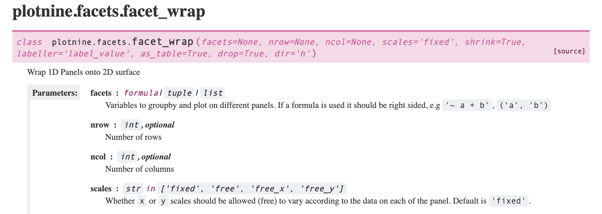

```{python setup, tags=c("input-details", "setup")}
# TODO: explain how to run this, and that they only need the gist (loads tools)


import pandas as pd
from siuba import arrange, select, mutate, filter, _
from plotnine import ggplot, geom_point, coord_flip, aes, labs, facet_wrap

# temporary until I figure out where to put data
fname = "https://siublocks.s3.us-east-2.amazonaws.com/course-data/music200.csv"
music_top200 = pd.read_csv(fname)

# tracks
fname = "https://siublocks.s3.us-east-2.amazonaws.com/course-data/track_features.csv"
track_features = pd.read_csv(fname)

# TODO: shift into a package or file
from siuba import pipe
from IPython.display import HTML, display
from siututor import Blank
___ = Blank()

pd.set_option("display.max_rows", 6)

from IPython import get_ipython
# special ipython function to get the html formatter
html_formatter = get_ipython().display_formatter.formatters['text/html']

# when you see a Shout object, call the shout_html function on it
html_formatter.for_type(pd.DataFrame, lambda df: df.to_html(max_rows = pd.get_option("display.max_rows")))
```

```{python active="", eval=FALSE}

import slides from '../slides/02d-slides.markdown'

<RevealSlides :slides="slides" />

```

### Exercise 1: 


**TODO**

<!-- #region -->
### Exercise 2:

Below is the start of plotnine's documentation for `facet_wrap`. 




Notice that the Parameters section lists `ncol` and `nrow` options. These determine how many columns or rows to use. For example, the plot below has `nrow = 1`.

Try out the plot as is, and with the `nrow` argument changed to `ncol = 1`.
Then, answer the questions below.
<!-- #endregion -->

```{python}
# This code keeps the 3 artists listed ----
artists_to_keep = ["Billie Eilish", "ITZY", "Roddy Ricch"]

some_artists = (
  track_features
  >> filter(_.artist.isin(artists_to_keep))
)

# This code plots the data ----
(some_artists
  >> ggplot(aes("energy", "valence", color = "artist"))
   + geom_point()
   + facet_wrap("~artist", nrow = 1)
   + labs(title = "Song features across 3 artists")
)
```

<prompt-expandable header="Which of the three artists tends to have the lowest valence?">

<q-multiple-choice>
  <q-opt text="Billie Eilish"><span>Correct! We'll discuss how to measure the idea of "tends to have" in the next chapter.</span></q-opt>
  <q-opt text="ITZY"><span>That's not right. This artist tends to have the highest valence.</span></q-opt>
  <q-opt text="Roddy Ricch"><span>That's not right. Look for the cluster of points toward the bottom of the plot.</span></q-opt>
</q-multiple-choice>

</prompt-expandable>


Which value seems easier to compare across facets, when ncol is set to 1?

<details>
<summary>answer</summary>
    
This is subjective, but I would say energy is easier to compare, since there is only one x-axis for across all plots. (For example, there is a only one spot on the x-axis where energy is .25).
    
</details>
