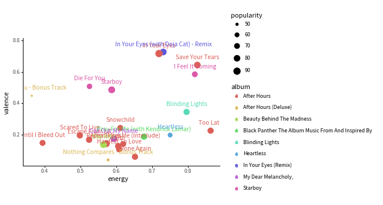

<Notebook
  v-slot="nb"
  branch="master"
  repo="machow/purview"
  url="https://mybinder.org"
  useBinder="1"
  useStorage="1"
  >

<code-cell  :status="nb.status" :onExecute="nb.execute" :onReady="nb.updateSetupCode"  language="python">

    # TODO: explain how to run this, and that they only need the gist (loads tools)
    
    # wranglign ---------
    import pandas as pd
    from siuba import *
    
    # plotting ----------
    from plotnine import *
    
    theme_set(theme_classic(base_family = "Noto Sans CJK JP"))
    
    # data --------------
    #fname = "/Users/machow/Dropbox/Repo/siublocks-org/intro-tidyverse/tutorial/data/music200.csv"
    fname = "https://siublocks.s3.us-east-2.amazonaws.com/course-data/music200.csv"
    music_top200 = pd.read_csv(fname)
    
    # tracks
    #fname = "/Users/machow/Dropbox/Repo/siublocks-org/intro-tidyverse/tutorial/data/track_features.csv"
    fname = "https://siublocks.s3.us-east-2.amazonaws.com/course-data/track_features.csv"
    track_features = pd.read_csv(fname)
    
    # student support ----------
    from siuba import pipe
    from IPython.display import HTML, display
    from siututor import Blank
    ___ = Blank()
    
    # DataFrame display --------
    pd.set_option("display.max_rows", 6)
    
    from IPython import get_ipython
    # special ipython function to get the html formatter
    html_formatter = get_ipython().display_formatter.formatters['text/html']
    
    # here, we avoid the default df._repr_html_ method, since it inlines css
    # (style tags make vue angry)
    html_formatter.for_type(
        pd.DataFrame,
        lambda df: df.to_html(max_rows = pd.get_option("display.max_rows"), show_dimensions = True)
    )
    
    # remove the <ggplot: (528...)> printout
    html_formatter.for_type(ggplot, lambda g: "")
    

</code-cell>

import slides from '../slides/00-slides.markdown'

<RevealSlides :slides="slides" />

### Exercise 1: inspecting music data

Use the dropdown box below to change the code.
Try choosing "United States" from the dropdown, then click run.
This should return only the top 200 hits from the United States.

import CodeCellTemplater from '~/components/Cell/CodeCellTemplater.vue'

<CodeCellTemplater
  :templateVars="$frontmatter.exercise_pars[0]"
  :status="nb.status" :onExecute="nb.execute" language="python"
  >

    (music_top200
      >> filter(_.country == "${this.country}")
    )

<template v-slot:output>
<table border="1" class="dataframe dataframe">
  <thead>
    <tr style="text-align: right;">
      <th></th>
      <th>country</th>
      <th>position</th>
      <th>track_name</th>
      <th>artist</th>
      <th>streams</th>
      <th>duration</th>
      <th>continent</th>
    </tr>
  </thead>
  <tbody>
    <tr>
      <th>7800</th>
      <td>United States</td>
      <td>1</td>
      <td>The Box</td>
      <td>Roddy Ricch</td>
      <td>12987027</td>
      <td>196.653</td>
      <td>Americas</td>
    </tr>
    <tr>
      <th>7801</th>
      <td>United States</td>
      <td>2</td>
      <td>Myron</td>
      <td>Lil Uzi Vert</td>
      <td>9163134</td>
      <td>224.955</td>
      <td>Americas</td>
    </tr>
    <tr>
      <th>7802</th>
      <td>United States</td>
      <td>3</td>
      <td>Blueberry Faygo</td>
      <td>Lil Mosey</td>
      <td>8043475</td>
      <td>162.547</td>
      <td>Americas</td>
    </tr>
    <tr>
      <th>...</th>
      <td>...</td>
      <td>...</td>
      <td>...</td>
      <td>...</td>
      <td>...</td>
      <td>...</td>
      <td>...</td>
    </tr>
    <tr>
      <th>7997</th>
      <td>United States</td>
      <td>198</td>
      <td>Lights Up</td>
      <td>Harry Styles</td>
      <td>1606234</td>
      <td>172.227</td>
      <td>Americas</td>
    </tr>
    <tr>
      <th>7998</th>
      <td>United States</td>
      <td>199</td>
      <td>Without Me</td>
      <td>Halsey</td>
      <td>1606153</td>
      <td>201.661</td>
      <td>Americas</td>
    </tr>
    <tr>
      <th>7999</th>
      <td>United States</td>
      <td>200</td>
      <td>Enemies (feat. DaBaby)</td>
      <td>Post Malone</td>
      <td>1597824</td>
      <td>196.760</td>
      <td>Americas</td>
    </tr>
  </tbody>
</table>
</template>

</CodeCellTemplater>

<prompt-expandable header="Which artist has a track in the second position on the United States charts?">

<q-multiple-choice>
  <q-opt text="Roddy Ricch">Try again. That artist is in the first position.</q-opt>
  <q-opt text="Lil Uzi Vert">That's right!</q-opt>
  <q-opt text="Halsey">Try again. That artist is the second from last position (198).</q-opt>
</q-multiple-choice>

</prompt-expandable>

### Exercise 2: inspecting `track_features` data

Use the options below, to examine tracks by different artists. Can you find the options that order tracks from highest energy to lowest?

<CodeCellTemplater
  :templateVars="$frontmatter.exercise_pars[1]"
  :status="nb.status" :onExecute="nb.execute" language="python"
  >

    (track_features
      >> arrange(${this.arrangeVar})
      >> filter(_.artist == "${this.artist}")
    )
    
<template v-slot:output>

<table border="1" class="dataframe dataframe">
  <thead>
    <tr style="text-align: right;">
      <th></th>
      <th>artist</th>
      <th>album</th>
      <th>track_name</th>
      <th>energy</th>
      <th>valence</th>
      <th>danceability</th>
      <th>speechiness</th>
      <th>acousticness</th>
      <th>popularity</th>
      <th>duration</th>
    </tr>
  </thead>
  <tbody>
    <tr>
      <th>22431</th>
      <td>The Weeknd</td>
      <td>After Hours (Deluxe)</td>
      <td>Missed You - Bonus Track</td>
      <td>0.364</td>
      <td>0.4480</td>
      <td>0.716</td>
      <td>0.0866</td>
      <td>0.10700</td>
      <td>48</td>
      <td>144.540</td>
    </tr>
    <tr>
      <th>3889</th>
      <td>The Weeknd</td>
      <td>After Hours (Deluxe)</td>
      <td>Nothing Compares - Bonus Track</td>
      <td>0.577</td>
      <td>0.0398</td>
      <td>0.524</td>
      <td>0.0358</td>
      <td>0.00253</td>
      <td>49</td>
      <td>222.307</td>
    </tr>
    <tr>
      <th>17384</th>
      <td>The Weeknd</td>
      <td>Heartless</td>
      <td>Heartless</td>
      <td>0.750</td>
      <td>0.1980</td>
      <td>0.531</td>
      <td>0.1110</td>
      <td>0.00632</td>
      <td>60</td>
      <td>200.080</td>
    </tr>
    <tr>
      <th>...</th>
      <td>...</td>
      <td>...</td>
      <td>...</td>
      <td>...</td>
      <td>...</td>
      <td>...</td>
      <td>...</td>
      <td>...</td>
      <td>...</td>
      <td>...</td>
    </tr>
    <tr>
      <th>9284</th>
      <td>The Weeknd</td>
      <td>After Hours</td>
      <td>After Hours</td>
      <td>0.572</td>
      <td>0.1430</td>
      <td>0.664</td>
      <td>0.0305</td>
      <td>0.08110</td>
      <td>84</td>
      <td>361.027</td>
    </tr>
    <tr>
      <th>24689</th>
      <td>The Weeknd</td>
      <td>Starboy</td>
      <td>Starboy</td>
      <td>0.587</td>
      <td>0.4860</td>
      <td>0.679</td>
      <td>0.2760</td>
      <td>0.14100</td>
      <td>84</td>
      <td>230.453</td>
    </tr>
    <tr>
      <th>24983</th>
      <td>The Weeknd</td>
      <td>After Hours</td>
      <td>In Your Eyes</td>
      <td>0.719</td>
      <td>0.7170</td>
      <td>0.667</td>
      <td>0.0346</td>
      <td>0.00285</td>
      <td>91</td>
      <td>237.520</td>
    </tr>
  </tbody>
</table>

</template>    

</CodeCellTemplater>

### Exercise 3: Plotting track features

Here is one kind of plot you will learn to make in the course.

Once you've tried some options, scroll down and click next to get started with the first chapter!

<CodeCellTemplater
  :templateVars="$frontmatter.exercise_pars[2]"
  :status="nb.status" :onExecute="nb.execute" language="python"
  >

    (track_features
      >> filter(_.artist == "${this.artist}")
      >> ggplot(aes("energy", "valence", size = "${this.size}", color = "album", label = "track_name"))
       + geom_point()
       + geom_text(nudge_y = .05, size = 10)
    )

<template v-slot:output>

</template>

</CodeCellTemplater>

</Notebook>

