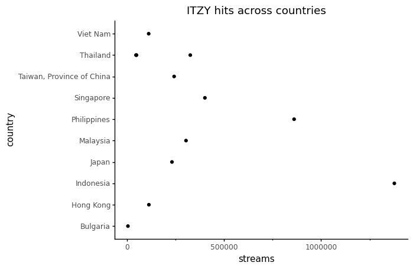

<Notebook
  v-slot="nb"
  branch="master"
  repo="machow/purview"
  url="https://mybinder.org"
  useBinder="1"
  >


# Introduction to Data Analysis with Siuba: Basics


<details v-fix-codemirror v-show="nb.debut">
<code-cell  :status="nb.status" :onExecute="nb.execute" :onReady="nb.updateSetupCode"  language="python">


    # TODO: explain how to run this, and that they only need the gist (loads tools)
    
    # wranglign ---------
    import pandas as pd
    from siuba import *
    
    # plotting ----------
    from plotnine import *
    
    theme_set(theme_classic(base_family = "Noto Sans CJK JP"))
    
    # data --------------
    #fname = "/Users/machow/Dropbox/Repo/siublocks-org/intro-tidyverse/tutorial/data/music200.csv"
    fname = "https://siublocks.s3.us-east-2.amazonaws.com/course-data/music200.csv"
    music_top200 = pd.read_csv(fname)
    
    # tracks
    #fname = "/Users/machow/Dropbox/Repo/siublocks-org/intro-tidyverse/tutorial/data/track_features.csv"
    fname = "https://siublocks.s3.us-east-2.amazonaws.com/course-data/track_features.csv"
    track_features = pd.read_csv(fname)
    
    # student support ----------
    from siuba import pipe
    from IPython.display import HTML, display
    from siututor import Blank
    ___ = Blank()
    
    # DataFrame display --------
    pd.set_option("display.max_rows", 6)
    
    from IPython import get_ipython
    # special ipython function to get the html formatter
    html_formatter = get_ipython().display_formatter.formatters['text/html']
    
    # here, we avoid the default df._repr_html_ method, since it inlines css
    # (style tags make vue angry)
    html_formatter.for_type(
        pd.DataFrame,
        lambda df: df.to_html(max_rows = pd.get_option("display.max_rows"), show_dimensions = True)
    )
    
    


</code-cell>
</details>

import slides from '../slides/01a-slides.markdown'

<RevealSlides :slides="slides" />


## Introduction to Spotify data

<code-cell  :status="nb.status" :onExecute="nb.execute"  ex="a" :exIndx="0" language="python">


    #from IPython.display import HTML, display
    music_top200


<template v-slot:output>


<table border="1" class="dataframe">
  <thead>
    <tr style="text-align: right;">
      <th></th>
      <th>country</th>
      <th>position</th>
      <th>track_name</th>
      <th>artist</th>
      <th>streams</th>
      <th>duration</th>
      <th>continent</th>
    </tr>
  </thead>
  <tbody>
    <tr>
      <th>0</th>
      <td>Argentina</td>
      <td>1</td>
      <td>Tusa</td>
      <td>KAROL G</td>
      <td>1858666</td>
      <td>200.960</td>
      <td>Americas</td>
    </tr>
    <tr>
      <th>1</th>
      <td>Argentina</td>
      <td>2</td>
      <td>Tattoo</td>
      <td>Rauw Alejandro</td>
      <td>1344382</td>
      <td>202.887</td>
      <td>Americas</td>
    </tr>
    <tr>
      <th>2</th>
      <td>Argentina</td>
      <td>3</td>
      <td>Hola - Remix</td>
      <td>Dalex</td>
      <td>1330011</td>
      <td>249.520</td>
      <td>Americas</td>
    </tr>
    <tr>
      <th>...</th>
      <td>...</td>
      <td>...</td>
      <td>...</td>
      <td>...</td>
      <td>...</td>
      <td>...</td>
      <td>...</td>
    </tr>
    <tr>
      <th>12397</th>
      <td>South Africa</td>
      <td>198</td>
      <td>Black And White</td>
      <td>Niall Horan</td>
      <td>11771</td>
      <td>193.090</td>
      <td>Africa</td>
    </tr>
    <tr>
      <th>12398</th>
      <td>South Africa</td>
      <td>199</td>
      <td>When I See U</td>
      <td>Fantasia</td>
      <td>11752</td>
      <td>217.347</td>
      <td>Africa</td>
    </tr>
    <tr>
      <th>12399</th>
      <td>South Africa</td>
      <td>200</td>
      <td>Psycho!</td>
      <td>MASN</td>
      <td>11743</td>
      <td>197.217</td>
      <td>Africa</td>
    </tr>
  </tbody>
</table>
<p>12400 rows × 7 columns</p>


</template>

</code-cell>


> 🔎 How many streams did the track named Blinding lights get this week?

> 🔎 How many rows in the 12,417 row DataFrame are being shown above?

> 🔎 What is the speechiness level of the track named Myron?

<details>
    <summary>show answers</summary>

    * Blinding lights was streamed 7744570 times.
    * 10 rows are being shown from the DataFrame
    * The track named Myron has a speechiness of 0.29
</details>
    

## What you'll learn to do

In this tutorial you will learn about..

* data that is represented in table called a DataFrame.
* how to arrange rows and select columns.
* how to create new columns and cut out specific rows.

The next two examples show what you'll be able to do by the end of this chapter.
It's okay if the code doesn't make sense yet.
Just being able to run someone else's code goes a long way!


### Big example 1: finding high energy hits

Run the code below. It should do the following:

* **arrange** the rows--first by position (lowest first), and second by energy (highest first).
* **select** specific columns, such as country, position, and artist.

<code-cell  :status="nb.status" :onExecute="nb.execute"  ex="a" :exIndx="0" language="python">


    (music_top200
      >> arrange(_.position, _.duration)
      >> select(_.country, _.position, _.artist, _.track_name, _.duration)
    )


<template v-slot:output>


<table border="1" class="dataframe">
  <thead>
    <tr style="text-align: right;">
      <th></th>
      <th>country</th>
      <th>position</th>
      <th>artist</th>
      <th>track_name</th>
      <th>duration</th>
    </tr>
  </thead>
  <tbody>
    <tr>
      <th>2600</th>
      <td>Germany</td>
      <td>1</td>
      <td>Ufo361</td>
      <td>Bad Girls, Good Vibes</td>
      <td>107.446</td>
    </tr>
    <tr>
      <th>4400</th>
      <td>Greece</td>
      <td>1</td>
      <td>Snik</td>
      <td>Drip</td>
      <td>147.429</td>
    </tr>
    <tr>
      <th>2000</th>
      <td>Colombia</td>
      <td>1</td>
      <td>J Balvin</td>
      <td>Rojo</td>
      <td>150.720</td>
    </tr>
    <tr>
      <th>...</th>
      <td>...</td>
      <td>...</td>
      <td>...</td>
      <td>...</td>
      <td>...</td>
    </tr>
    <tr>
      <th>11999</th>
      <td>Uruguay</td>
      <td>200</td>
      <td>Callejeros</td>
      <td>Creo</td>
      <td>289.760</td>
    </tr>
    <tr>
      <th>3999</th>
      <td>Finland</td>
      <td>200</td>
      <td>Eminem</td>
      <td>Without Me</td>
      <td>290.320</td>
    </tr>
    <tr>
      <th>4399</th>
      <td>United Kingdom</td>
      <td>200</td>
      <td>TOTO</td>
      <td>Africa</td>
      <td>295.893</td>
    </tr>
  </tbody>
</table>
<p>12400 rows × 5 columns</p>


</template>

</code-cell>


Try doing the actions below, and then running the code.

> 🔨 Try changing the two uses of `_.energy` above to `_.danciness`.

### Big example 2: which countries does an artist have hits in?

Run the code below. It should do the following:

* **filter** to keep rows for the artist ITZY
* use **ggplot** to add a point for each row in the filtered data.

<code-cell  :status="nb.status" :onExecute="nb.execute"  ex="a" :exIndx="0" language="python">


    (music_top200
      >> filter(_.artist == "ITZY")
      >> ggplot(aes("streams", "country")) + geom_point() + labs(title = "ITZY hits across countries")
    )


<template v-slot:output>

    findfont: Font family ['Noto Sans CJK JP'] not found. Falling back to DejaVu Sans.
    findfont: Font family ['Noto Sans CJK JP'] not found. Falling back to DejaVu Sans.
    findfont: Font family ['Noto Sans CJK JP'] not found. Falling back to DejaVu Sans.





    <ggplot: (292078796)>


</template>

</code-cell>


> 🔨 Try changing the term `"ITZY"` to `"TIX"`. How many countries have TIX hits?

> 🔨 Try stopping the plot with a comment. That is, put `#` to the left of `>> ggplot`. This should show you the raw data.

<details>
    <summary>solution</summary>

Here is the solution code...
    
```python
# code with artist changed, and plot commented out
(music_top200
  >> filter(_.artist == "TIX")
  #>> ggplot(aes("streams", "country")) + geom_point() + labs(title = "ITZY hits across countries")
)
```

</details>


</Notebook>

