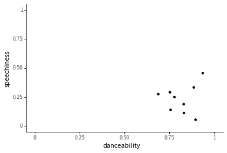

<Notebook
  v-slot="nb"
  branch="master"
  repo="machow/purview"
  url="https://mybinder.org"
  useBinder="1"
  useStorage="1"
  >

<code-cell  :status="nb.status" :onExecute="nb.execute" :onReady="nb.updateSetupCode"  language="python">

    # TODO: explain how to run this, and that they only need the gist (loads tools)
    
    # wranglign ---------
    import pandas as pd
    from siuba import *
    
    # plotting ----------
    from plotnine import *
    
    theme_set(theme_classic(base_family = "Noto Sans CJK JP"))
    
    # data --------------
    from music_top200 import music_top200, track_features
    
    # student support ----------
    from siuba import pipe
    from IPython.display import HTML, display
    from siututor import Blank
    ___ = Blank()
    
    # DataFrame display --------
    pd.set_option("display.max_rows", 6)
    
    from IPython import get_ipython
    # special ipython function to get the html formatter
    html_formatter = get_ipython().display_formatter.formatters['text/html']
    
    # here, we avoid the default df._repr_html_ method, since it inlines css
    # (style tags make vue angry)
    html_formatter.for_type(
        pd.DataFrame,
        lambda df: df.to_html(max_rows = pd.get_option("display.max_rows"), show_dimensions = True)
    )
    
    # remove the <ggplot: (528...)> printout
    html_formatter.for_type(ggplot, lambda g: "")
    

</code-cell>

import slides from '../slides/02-slides.markdown'

<RevealSlides :slides="slides" />

### Exercise 1: 

In this exercise, there are two code cells. The first defines variables for tracks by different artists. The second creates a plot.

Read through the code and plot, and then modify it to answer the question beneath.

<code-cell  :status="nb.status" :onExecute="nb.execute"  ex="a" :exIndx="0" language="python">

    roddy = (
      track_features
      >> filter(_.artist == "Roddy Ricch")
    )
    
    billie = (
      track_features
      >> filter(_.artist == "Billie Eilish")
    )
    
    other = (
      track_features
      >> filter(_.artist == "ITZY")
    )
    
    other

<template v-slot:output>

<table border="1" class="dataframe">
  <thead>
    <tr style="text-align: right;">
      <th></th>
      <th>artist</th>
      <th>album</th>
      <th>track_name</th>
      <th>energy</th>
      <th>valence</th>
      <th>danceability</th>
      <th>speechiness</th>
      <th>acousticness</th>
      <th>popularity</th>
      <th>duration</th>
    </tr>
  </thead>
  <tbody>
    <tr>
      <th>1431</th>
      <td>ITZY</td>
      <td>IT'z Different</td>
      <td>달라달라 (DALLA DALLA)</td>
      <td>0.853</td>
      <td>0.713</td>
      <td>0.790</td>
      <td>0.0665</td>
      <td>0.00116</td>
      <td>73</td>
      <td>199.874</td>
    </tr>
    <tr>
      <th>21148</th>
      <td>ITZY</td>
      <td>IT'z Different</td>
      <td>달라달라 DALLA DALLA</td>
      <td>0.853</td>
      <td>0.713</td>
      <td>0.790</td>
      <td>0.0665</td>
      <td>0.00116</td>
      <td>57</td>
      <td>199.874</td>
    </tr>
    <tr>
      <th>22388</th>
      <td>ITZY</td>
      <td>It'z Me</td>
      <td>WANNABE</td>
      <td>0.911</td>
      <td>0.640</td>
      <td>0.809</td>
      <td>0.0617</td>
      <td>0.00795</td>
      <td>81</td>
      <td>191.242</td>
    </tr>
    <tr>
      <th>25287</th>
      <td>ITZY</td>
      <td>IT'z ICY</td>
      <td>ICY</td>
      <td>0.904</td>
      <td>0.814</td>
      <td>0.801</td>
      <td>0.0834</td>
      <td>0.03240</td>
      <td>72</td>
      <td>191.142</td>
    </tr>
  </tbody>
</table>

4 rows × 10 columns

</template>

</code-cell>

The code below plots hits for the `roddy` variable.
Note that you could swap out `roddy` for any of the other two variables above.

<code-cell  :status="nb.status" :onExecute="nb.execute"  ex="a" :exIndx="0" language="python">

    (roddy
      >> ggplot(aes("danceability", "speechiness"))
       + geom_point()
       + expand_limits(x = [0, 1], y = [0, 1])
    )

<template v-slot:output>

</template>

</code-cell>

<prompt-expandable header="Who has the widest range of danceability? (i.e. biggist difference between highest and lowest)">

<q-multiple-choice>
  <q-opt text="Roddy Ricch">Try again.</q-opt>
  <q-opt text="Billie Eilish">That's right!</q-opt>
  <q-opt text="ITZY">Try again. All the ITZY songs shown have roughly the same danceability.</q-opt>
</q-multiple-choice>

</prompt-expandable>

### Exercise 2:

Does it look like there any extremely popular songs over 15 minutes long?

There is not one concrete answer to this question.
Make a plot below, and come up with an answer you might share with another person.

hint

> The duration column contains the length of each song in seconds. Use this with the popularity column.

<code-cell  :status="nb.status" :onExecute="nb.execute"  ex="a" :exIndx="0" language="python">

    (track_features
      >> ggplot()
    
    )

<template v-slot:output>

</template>

</code-cell>

possible answers

    
<a target="_blank" href="https://v.usetapes.com/XhWxJ9lAox">screencast</a>
    
    

### Exercise 3:

Does the lowest energy track belong to a "low energy" artist? In this exercise, we'll explore the questions using tracks by two artists.

Here is the track data sorted by energy.

<code-cell  :status="nb.status" :onExecute="nb.execute"  ex="a" :exIndx="0" language="python">

    # this code is to help you examine track energy levels 
    (
      track_features
      >> arrange(_.energy)
    )

<template v-slot:output>

<table border="1" class="dataframe">
  <thead>
    <tr style="text-align: right;">
      <th></th>
      <th>artist</th>
      <th>album</th>
      <th>track_name</th>
      <th>energy</th>
      <th>valence</th>
      <th>danceability</th>
      <th>speechiness</th>
      <th>acousticness</th>
      <th>popularity</th>
      <th>duration</th>
    </tr>
  </thead>
  <tbody>
    <tr>
      <th>1003</th>
      <td>Simon Smith</td>
      <td>Loops</td>
      <td>Blagaslavlaju vas</td>
      <td>0.000778</td>
      <td>0.000</td>
      <td>0.779</td>
      <td>0.4210</td>
      <td>0.99400</td>
      <td>0</td>
      <td>36.038</td>
    </tr>
    <tr>
      <th>5995</th>
      <td>DMS</td>
      <td>Prepáčte</td>
      <td>Nič</td>
      <td>0.000791</td>
      <td>0.000</td>
      <td>0.571</td>
      <td>0.4460</td>
      <td>0.95000</td>
      <td>25</td>
      <td>37.355</td>
    </tr>
    <tr>
      <th>16689</th>
      <td>Peter Simon</td>
      <td>Snowrain</td>
      <td>Snowrain</td>
      <td>0.003480</td>
      <td>0.373</td>
      <td>0.472</td>
      <td>0.0517</td>
      <td>0.99600</td>
      <td>0</td>
      <td>31.000</td>
    </tr>
    <tr>
      <th>...</th>
      <td>...</td>
      <td>...</td>
      <td>...</td>
      <td>...</td>
      <td>...</td>
      <td>...</td>
      <td>...</td>
      <td>...</td>
      <td>...</td>
      <td>...</td>
    </tr>
    <tr>
      <th>22695</th>
      <td>Nino Xypolitas</td>
      <td>Epireastika</td>
      <td>Eime Enas Allos - Original</td>
      <td>0.996000</td>
      <td>0.517</td>
      <td>0.644</td>
      <td>0.1030</td>
      <td>0.00346</td>
      <td>34</td>
      <td>214.693</td>
    </tr>
    <tr>
      <th>17072</th>
      <td>Otira</td>
      <td>Soundboy Burnin’</td>
      <td>Soundboy Burnin’</td>
      <td>0.997000</td>
      <td>0.327</td>
      <td>0.568</td>
      <td>0.2330</td>
      <td>0.00299</td>
      <td>14</td>
      <td>173.846</td>
    </tr>
    <tr>
      <th>11069</th>
      <td>Scooter</td>
      <td>No Time To Chill</td>
      <td>How Much Is the Fish?</td>
      <td>0.999000</td>
      <td>0.615</td>
      <td>0.533</td>
      <td>0.0786</td>
      <td>0.00130</td>
      <td>48</td>
      <td>226.200</td>
    </tr>
  </tbody>
</table>

25321 rows × 10 columns

</template>

</code-cell>

 Notice that Simon Smith has the lowest energy song ("Blagaslavlaju vas"), while Scooter has the highest energy song ("How Much is the Fish?").

First, filter the track_features data to create a variable named `artist_low` that has only tracks by the artist Simon Smith.

<code-cell  :status="nb.status" :onExecute="nb.execute"  ex="a" :exIndx="0" language="python">

    # create artist_low variable here
    
    artist_low = (
        
    )

</code-cell>

Next, create a variable named `artist_high` with tracks by the artist Scooter, who has the highest energy song.

<code-cell  :status="nb.status" :onExecute="nb.execute"  ex="a" :exIndx="0" language="python">

    # create artist_high variable here
    
     

</code-cell>

Based on separate plots of their data, does the artist with the lowest energy track seem to have lower energy songs in general?

<code-cell  :status="nb.status" :onExecute="nb.execute"  ex="a" :exIndx="0" language="python">

    # examine plots of each artist, to answer question
    # note, we're examining energy, so to make a scatterplot you could set
    # the second variable to anything interesting (e.g. popularity)
    
    (___
    
    )

<template v-slot:output>

⚠️: <b>Don't forget to replace all the blanks!</b>

</template>

</code-cell>

possible answer

The high energy artist, Scooter, seems to only have high energy songs (from about .9 to 1 energy).
    
On the other hand, the low energy artist, Simon Smith, seems to have a wide range of energy values (from about 0 to 1 energy).

</Notebook>

