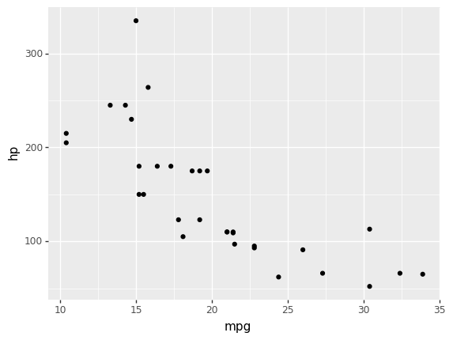

# Some title

<code-cell :kernel="sp.kernel" language="python">
from plotnine import *
from siuba.data import mtcars

ggplot(mtcars, aes("mpg", "hp")) + geom_point()
</code-cell>

    <ggplot: (-9223372036550634850)>

## Unevaluated markdown

* what will happen?
* who knows

